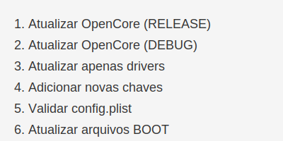

# Update-OC-EFI Script 🚀

[](https://www.youtube.com/@HackintoshAndBeyond)

**A professional, safe, and fully automated utility to update OpenCore, maintain Kexts/Drivers, and merge `config.plist` changes on Hackintosh setups.**

Designed to make Hackintosh maintenance effortless, this script interacts with your EFI partitions, downloads official Acidanthera releases, performs intelligent driver merging, automates pre-release tracking via GitHub's API, and features a dual-language (EN/PT-BR) output system.

---

### 🌐 Socials & Contact
- **YouTube Channel** - [www.youtube.com/@HackintoshAndBeyond](https://www.youtube.com/@HackintoshAndBeyond)
- **Tool Tutorial Video** - [Watch the Video Here](https://youtu.be/dH-TH812sTQ)
- **Discord Community** - [Join us at discord.gg/5hvZ5u7QXQ](https://discord.gg/5hvZ5u7QXQ)

---

### 🔥 Key Features

1. **Intuitive Menu Interface & Multi-Language**
   A simple and straightforward menu detects your macOS environment to display information in English (en_US) or natively translated to Portuguese (pt-BR).

   

2. **Automatic FAT32/EFI Partition Detection**
   The script intelligently scans both internal drives and external USBs for any EFI or FAT32-formatted partition. It bypasses technical limitations by extracting true hardware names—like "SanDisk" or "WD Black"—and actual OS volume names.

3. **Smart Backup System**
   Before touching your system, the script creates an `EFI-Backup-<date>-<time>` copy directly into the targeted EFI partition, allowing for immediate fail-safe rollbacks if a boot sequence breaks. It automatically rotates old backups to save space.

4. **Direct OpenCore Downloads & Smart Fallback**
   Downloads the latest **RELEASE** or **DEBUG** version of OpenCore directly from the official Acidanthera GitHub.
   * **Smart Fallback:** If GitHub triggers a Rate Limit (HTTP 403), a custom scraping fallback steps in, guaranteeing you get your OpenCore files regardless of API exhaustion!

5. **Intelligent Boot File Updates**
   Updates core engine files (`BOOTx64.efi`, `OpenCore.efi`, `.contentVisibility`, and `.contentFlavour`) while keeping all your precious `config.plist`, custom SSDTs, Kexts, and customized GUI Resources strictly intact.

6. **Automatic Driver Pruning**
   Synchronizes and updates only the `.efi` drivers explicitly declared as "Enabled" in your `config.plist`. Identifies rogue or unused driver files hidden in your folder and asks if you would like to securely remove them.

7. **Sample.plist Merging Engine**
   Seamlessly parses structural changes from the new Acidanthera `Sample.plist` and injects new schema keys directly into your functional `config.plist`, ensuring you stay compliant with the newest OpenCore changes without erasing your hardware's quirks.

8. **SHA-256 Validation & temporary clean-ups**
   Automatically sweeps leftover artifacts, removes ZIP files, and completely closes out temp environments once the bootloader updates successfully.

---

### ⚙️ How to Use

1. **Download the Script**
   Grab the `update_opencore.py` script repository or clone it via git.

2. **Launch Terminal & Navigate**
   ```bash
   cd /Users/your_username/Downloads/update_opencore
   ```

3. **Install Requirements**
   Please make sure to have Python 3 and modules installed. (e.g. `requests`, `tqdm`).
   ```bash
   pip3 install requests tqdm
   ```

4. **Run the Script as Administrator**
   The tool requires `sudo` access to natively mount inactive EFI drives safely and manipulate your system.
   ```bash
   sudo python3 RunUpdateOpenCore.command
   # or
   sudo python3 main.py
   ```

---

### 💻 Prerequisites

* **macOS Environment**: Built for Hackintosh/macOS functionality relying on `diskutil`.
* **Python 3**: Comes heavily supported on macOS via Homebrew.
* **Network connection**: Essential for hitting GitHub API tags.

### 🛠️ Troubleshooting & Common Issues

- **`ModuleNotFoundError: No module named 'tqdm'` or `'requests'`**
  Missing python libraries. Ensure you run:
  ```bash
  python3 -m pip install requests tqdm
  ```

- **Permission Denied / Administrator Error**
  Always execute the script using `sudo`. The script intentionally enforces a safety lock preventing execution by standard users to avoid partial EFI corruption.

- **[Errno 28] No space left on device**
  You've run out of space on your hidden EFI partition. Open your EFI partition manually and discard very old bootloader logs or oversized Kexts.

---

### ⚠️ Disclaimer

This tool manipulates crucial system boot structures. A full system backup/USB Recovery drive is heavily recommended before running bootloader automations. The creator takes no liability for corrupted boot sectors or kernel panics arising from updated setups. Use the tool responsibly.

### 🤝 Contributions

Found a bug or want to enhance the Python workflow? Feel free to fork the repository, refine the logic, and submit a Pull Request! The Hackintosh community thrives on collaborative engineering!
